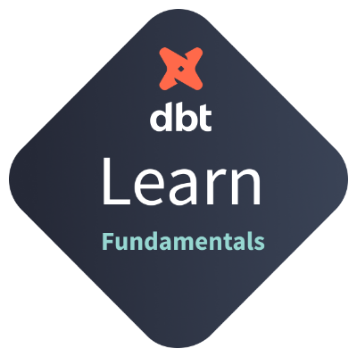

# dbt-Fundamentals

## About this Repo

  

This repository stores the project developed during the course **dbt Fundamentals**, needed for obtaining the oficial certificate.
This certificate guarantees his user's able to model, test, document, and deploy dbt models.

## What is dbt ?

According to the oficial dbt [docs](https://docs.getdbt.com/docs/introduction)
>dbt™ is a SQL-first transformation workflow  that lets teams quickly and collaboratively deploy analytics code following software
>engineering best practices like modularity, portability, CI/CD, and documentation. Now anyone on the data team can safely contribute to production-grade data pipelines.

dbt stands for **Data Build Tool** and allows users to define their data models using SQL, and then uses these models to generate optimized SQL code that can be run against a data warehouse or other data storage system. This allows users to build a maintainable and scalable data infrastructure that can be easily updated and extended over time.

In addition to generating SQL code, dbt also provides a number of features that make it easier to work with data. These features include the ability to manage dependencies between data models, run tests to ensure data integrity, and track the lineage of data to understand how it has been transformed over time.

## Resources

+ Take the [dbt Fundamentals](https://courses.getdbt.com/courses/fundamentals) course
+ Learn more about dbt on the [docs](https://docs.getdbt.com/docs/introduction)
+ Check out another [project](https://github.com/gabriel-barata/data-pipeline-with-modern-data-stack) where I used dbt
